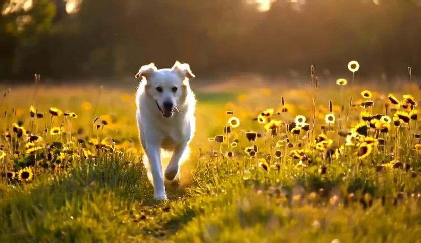

# draw-realtime

Real-time video-to-video AI diffusion with [StreamDiffusion](https://github.com/cumulo-autumn/StreamDiffusion). Transform videos using AI-powered style transfer with side-by-side comparison, multiple model options, and optional 1.58-bit quantization for faster inference.

## Features

### Core Features
- **Video-to-Video Processing** - Transform entire videos with AI diffusion models
- **Side-by-Side Comparison** - Synchronized playback of input and output
- **Multiple Models** - SD-Turbo, SD 1.5 + LCM, Hyper-SDXL, FLUX.2 Klein
- **1.58-bit Quantization** - BitNet-style PTQ for faster inference and lower memory
- **Real-time Preview** - Watch generation progress with live frame updates
- **Multi-Style Generation** - Generate 5 artistic styles from a single video using LLaVA + FLUX
- **Text-to-Video Generation** - Generate videos from text prompts using MonarchRT / Wan2.1

### Input Options
- Upload MP4 from browser
- Server-side video library
- Webcam capture (experimental)

### Output Options
- Web UI with synchronized playback
- CLI for batch processing
- REST API for integration

## Quick Start

<!-- one-command-install -->
> **One-command install**: clone, configure, and run in a single step:
>
> ```bash
> curl -fsSL https://raw.githubusercontent.com/jasperan/draw-realtime/main/install.sh | bash
> ```
>
> <details><summary>Advanced options</summary>
>
> Override install location:
> ```bash
> PROJECT_DIR=/opt/myapp curl -fsSL https://raw.githubusercontent.com/jasperan/draw-realtime/main/install.sh | bash
> ```
>
> Or install manually:
> ```bash
> git clone https://github.com/jasperan/draw-realtime.git
> cd draw-realtime
> # See below for setup instructions
> ```
> </details>


### Prerequisites

- NVIDIA GPU with CUDA support (RTX 2060+ recommended, 8GB+ VRAM)
- [Miniconda](https://docs.conda.io/en/latest/miniconda.html) or Anaconda
- Node.js 18+ (for frontend)
- ffmpeg

### Installation

```bash
# Clone repository
git clone https://github.com/jasperan/draw-realtime.git
cd draw-realtime

# Create conda environment
conda create -n streamdiffusion python=3.10 -y
conda activate streamdiffusion

# Install PyTorch with CUDA (choose your CUDA version)
# For CUDA 11.8:
pip install torch==2.1.0 torchvision==0.16.0 xformers --index-url https://download.pytorch.org/whl/cu118

# For CUDA 12.1:
pip install torch==2.1.0 torchvision==0.16.0 xformers --index-url https://download.pytorch.org/whl/cu121

# Install StreamDiffusion with TensorRT
pip install git+https://github.com/cumulo-autumn/StreamDiffusion.git@main#egg=streamdiffusion[tensorrt]
python -m streamdiffusion.tools.install-tensorrt

# Install project dependencies
pip install -r requirements.txt

# Build frontend
cd frontend && npm install && npm run build && cd ..
```

### Developer Verification

For local development, install the optional verification tools after the runtime
dependencies:

```bash
pip install -r requirements.txt -r requirements-dev.txt
```

Run the standard local check suite:

```bash
./scripts/verify.sh
```

The script runs syntax compilation, pytest when installed, frontend build/audit
checks when npm dependencies are present, optional Python security tooling, and
whitespace checks. Set `VERIFY_STRICT=1` to treat missing optional tools as
failures in CI-like environments. Python dependency and Bandit scans are
advisory by default because this repo currently has known ML-stack audit
findings; set `VERIFY_SECURITY_STRICT=1` to fail on those reports.

### Run

```bash
./start.sh
# Open http://localhost:7860
```

**First Run:**
- Models download automatically (~3GB for SD-Turbo)
- TensorRT engines compile on first use (5-10 minutes)
- Subsequent runs start instantly

## Models

| Model | FPS* | Quality | VRAM | Description |
|-------|------|---------|------|-------------|
| **SD-Turbo** | ~94 | Good | 4-5 GB | Default, single-step, fastest |
| **SD-Turbo 1.58-bit** | ~110+ | Good | 2-3 GB | Quantized, lower memory |
| **SD 1.5 + LCM** | ~37 | Higher | 5-6 GB | 4-step with LCM-LoRA |
| **SD 1.5 + LCM 1.58-bit** | ~45+ | Higher | 3-4 GB | Quantized, lower memory |
| **Hyper-SDXL** | ~20 | SDXL | 8 GB | 1-step SDXL quality |
| **FLUX.2 Klein** | ~8 | Highest | 10 GB | 4B parameter, best quality |
| **MonarchRT Self-Forcing** | 16* | Good | 8+ GB | Real-time autoregressive text-to-video |
| **MonarchRT Wan2.1** | 0.3* | High | 8+ GB | Bidirectional text-to-video, 1.3B params |

*FPS measured on RTX 4090 (Self-Forcing) / A10 (Wan2.1)

## Text-to-Video Generation (MonarchRT)

Generate videos from text prompts using [MonarchRT](https://github.com/Infini-AI-Lab/MonarchRT) with Wan2.1 models. MonarchRT uses Monarch matrix attention for efficient Diffusion Transformers.

**Sample output** (Wan2.1-T2V-1.3B, 21 frames, 832x480, 30 steps on A10):

> Prompt: *"A golden retriever running through a sunlit meadow with wildflowers, cinematic, beautiful lighting"*



[View full video](docs/samples/monarchrt_sample.mp4)

### MonarchRT Usage

**Web UI:** Select "MonarchRT Wan2.1" from the model dropdown. The UI switches to text-to-video mode automatically.

**CLI:**
```bash
# Generate with default settings (21 frames, 832x480)
python cli.py generate "a cat sitting in a garden, cinematic"

# Specify model and frame count
python cli.py generate "ocean waves crashing on rocks" -m monarchrt-wan --frames 81

# Custom output path and seed
python cli.py generate "a futuristic city at night" -o output.mp4 --seed 42
```

**API:**
```bash
curl -X POST http://localhost:7860/api/generate \
  -H "Content-Type: application/json" \
  -d '{"prompt": "a cat in a garden", "model": "monarchrt-wan", "num_frames": 21}'
```

### MonarchRT Installation

```bash
# Clone MonarchRT into the project
git clone https://github.com/Infini-AI-Lab/MonarchRT.git
cd MonarchRT && pip install -r requirements.txt && python setup.py develop && cd ..

# Download Wan2.1-T2V-1.3B model
huggingface-cli download Wan-AI/Wan2.1-T2V-1.3B --local-dir MonarchRT/wan_models/Wan2.1-T2V-1.3B
```

Requires PyTorch >= 2.8.0, flash-attn, and CUDA GPU with 8+ GB VRAM.

## 1.58-bit Quantization

This project supports BitNet-style Post-Training Quantization (PTQ) to convert model weights to 1.58-bit ternary format ({-1, 0, +1}). This provides:

- **~8x smaller weights** - Reduced memory bandwidth
- **15-25% faster inference** - Simpler computations
- **~50% lower VRAM** - Run on smaller GPUs
- **Minimal quality loss** - <15% LPIPS degradation

### How It Works

The quantization uses absmean scaling:
```
scale = mean(|W|)           # Per-tensor scale factor
W_ternary = round(W/scale).clamp(-1, 1)  # Ternarize to {-1, 0, +1}
```

Only the U-Net linear layers are quantized. VAE and text encoder remain in FP16 for quality.

### Quantizing Models

```bash
# Quantize SD-Turbo
python scripts/quantize_model.py --model sd-turbo

# Quantize SD 1.5 + LCM
python scripts/quantize_model.py --model sd15-lcm

# Quantize both
python scripts/quantize_model.py --model all

# Skip verification (faster)
python scripts/quantize_model.py --model sd-turbo --no-verify
```

Quantized models are saved to `models/quantized/`.

### Using Quantized Models

**Web UI:** Select "SD-Turbo 1.58-bit" or "SD 1.5 + LCM 1.58-bit" from the model dropdown.

**CLI:**
```bash
python cli.py input.mp4 -m sd-turbo-1.58bit -s anime-ghibli
python cli.py input.mp4 -m sd15-lcm-1.58bit -p "oil painting style"
```

**API:**
```bash
curl -X POST http://localhost:7860/api/process \
  -F "video=@input.mp4" \
  -F "model=sd-turbo-1.58bit" \
  -F "prompt=cyberpunk neon city"
```

### Benchmarking

Compare original vs quantized performance:

```bash
# Benchmark SD-Turbo
python scripts/benchmark.py --model sd-turbo --iterations 100

# Benchmark all models
python scripts/benchmark.py --all --iterations 50

# Quick benchmark (no quality metrics)
python scripts/benchmark.py --model sd-turbo --no-quality
```

## CLI Usage

```bash
# Style preset
python cli.py input.mp4 -s anime-ghibli

# Custom prompt
python cli.py input.mp4 -p "oil painting, vibrant colors"

# Specific model
python cli.py input.mp4 -m sd15-lcm -s fantasy

# Quantized model
python cli.py input.mp4 -m sd-turbo-1.58bit -s cyberpunk-neon

# Process all server videos
python cli.py --process-all -s watercolor

# Multi-style generation (LLaVA + FLUX)
python cli.py multistyle input.mp4

# List options
python cli.py --list-styles
python cli.py --list-models
python cli.py --list-videos
```

## Style Presets

| Preset | Description |
|--------|-------------|
| `anime-ghibli` | Studio Ghibli inspired, soft colors |
| `anime-cyberpunk` | Anime + cyberpunk, neon, Makoto Shinkai style |
| `cyberpunk-neon` | Cyberpunk city, neon lights, rain |
| `oil-painting` | Classical oil painting, rich colors |
| `watercolor` | Soft watercolor, flowing colors |
| `fantasy` | Magical fantasy art, ethereal |
| `dark-gothic` | Dark gothic, moody atmosphere |
| `comic-pop` | Comic book / pop art style |
| `photorealistic` | Ultra-detailed photorealistic |
| `impressionist` | Impressionist painting, Monet style |
| `pixel-art` | 16-bit retro pixel art |
| `sketch` | Pencil sketch, detailed linework |

## Multi-Style Generation

Generate 5 artistic variations of a video automatically:

```bash
python cli.py multistyle input.mp4
```

This:
1. Analyzes the video content using LLaVA (local vision model via Ollama)
2. Generates descriptions of key frames
3. Creates 5 style variations using FLUX.2 Klein:
   - Oil painting
   - Watercolor
   - Impressionist
   - Pop Art
   - Ukiyo-e (Japanese woodblock)
4. Produces a comparison grid video

**Requirements:** Ollama with `llava` and `llama3.2` models installed.

## API Reference

| Endpoint | Method | Description |
|----------|--------|-------------|
| `/api/settings` | GET | Get models, presets, configuration |
| `/api/videos` | GET | List server-side videos |
| `/api/upload` | POST | Upload a video file |
| `/api/process` | POST | Start video processing job |
| `/api/job/{id}` | GET | Get job status and progress |
| `/api/jobs` | GET | List all jobs |
| `/api/output/{file}` | GET | Download processed video |
| `/api/preview/{file}` | GET | Get real-time preview frame |
| `/api/generate` | POST | Start text-to-video generation (MonarchRT) |
| `/api/multistyle/process` | POST | Start multi-style generation |
| `/api/multistyle/job/{id}` | GET | Get multi-style job status |

## Project Structure

```
draw-realtime/
├── app/                      # Python backend
│   ├── main.py              # FastAPI server
│   ├── pipeline.py          # Model wrapper with switching
│   ├── config.py            # Models, presets, configuration
│   ├── video_processor.py   # Batch video processing
│   ├── monarchrt_pipeline.py # MonarchRT text-to-video wrapper
│   ├── multistyle.py        # LLaVA + FLUX multi-style
│   └── quantization/        # 1.58-bit PTQ module
│       ├── bitlinear.py     # BitLinear layer implementation
│       ├── quantize.py      # Quantization functions
│       └── utils.py         # Save/load utilities
├── scripts/
│   ├── quantize_model.py    # One-time quantization script
│   └── benchmark.py         # Performance comparison
├── frontend/                 # Svelte web UI
│   ├── src/App.svelte       # Main UI component
│   └── build/               # Production build
├── models/
│   └── quantized/           # Quantized model weights
├── videos/                   # Server-side videos
├── uploads/                  # User uploads
├── outputs/                  # Processed videos
├── engines/                  # TensorRT cached engines
├── MonarchRT/                # MonarchRT text-to-video (optional)
├── StreamDiffusion/          # StreamDiffusion library
├── cli.py                    # Command-line interface
├── requirements.txt
└── start.sh
```

## Configuration

Environment variables:

```bash
HOST=0.0.0.0          # Server bind address
PORT=7860             # Server port
VIDEOS_DIR=videos     # Input videos directory
ENGINES_DIR=engines   # TensorRT engines cache
DEBUG=true            # Enable debug logging
```

Edit `app/config.py` for:
- Default resolution (512x512)
- Acceleration backend (tensorrt/xformers)
- TinyVAE toggle
- Max queue size

## Performance Tips

### Maximize Speed
1. Use TensorRT acceleration (default)
2. Use SD-Turbo or SD-Turbo-1.58bit
3. Process at 512x512 resolution
4. Enable TinyVAE (default)

### Minimize VRAM
1. Use 1.58-bit quantized models
2. Use SD-Turbo (smallest model)
3. Reduce resolution in config.py
4. Process shorter clips

### Best Quality
1. Use FLUX.2 Klein or SD 1.5 + LCM
2. Process at native resolution
3. Use descriptive prompts
4. Avoid quantized models for final output

## Troubleshooting

### TensorRT fails to compile
System automatically falls back to xformers. Check CUDA version compatibility.

### Out of memory
- Use 1.58-bit quantized models
- Reduce resolution in `app/config.py`
- Use SD-Turbo instead of larger models
- Process shorter video clips

### Quantized model not found
Run the quantization script first:
```bash
python scripts/quantize_model.py --model sd-turbo
```

### Video won't play in browser
- Ensure ffmpeg is installed for H.264 encoding
- Try Chrome (best compatibility)

### Multi-style fails
- Ensure Ollama is running with `llava` and `llama3.2` models
- Check Ollama is accessible at localhost:11434

## Technology

- [StreamDiffusion](https://github.com/cumulo-autumn/StreamDiffusion) - Real-time diffusion pipeline
- [Stable Diffusion Turbo](https://huggingface.co/stabilityai/sd-turbo) - Fast single-step model
- [FLUX.2 Klein](https://huggingface.co/black-forest-labs/FLUX.2-klein-4B) - High-quality 4B model
- [LCM-LoRA](https://huggingface.co/latent-consistency/lcm-lora-sdv1-5) - Latent consistency LoRA
- [TensorRT](https://developer.nvidia.com/tensorrt) - NVIDIA inference optimization
- [BitNet](https://arxiv.org/abs/2310.11453) - 1.58-bit quantization inspiration
- [MonarchRT](https://github.com/Infini-AI-Lab/MonarchRT) - Real-time video generation with Monarch attention
- [Wan2.1](https://github.com/Wan-Video/Wan2.1) - Text-to-video diffusion model
- [FastAPI](https://fastapi.tiangolo.com/) - Python web framework
- [Svelte](https://svelte.dev/) - Frontend framework

## References

- [StreamDiffusion: Real-Time Interactive Generation](https://arxiv.org/abs/2312.12491)
- [BitNet: 1-bit LLMs](https://arxiv.org/abs/2310.11453)
- [The Era of 1-bit LLMs](https://arxiv.org/abs/2402.17764) - 1.58-bit quantization
- [FLUX 1.58-bit](https://huggingface.co/black-forest-labs/flux1-schnell-1.58bit) - Reference implementation
- [MonarchRT: Real-Time Video Generation](https://arxiv.org/abs/2602.12271) - Monarch matrix attention for DiTs

## License

MIT License - See [LICENSE](LICENSE) for details.

## Acknowledgements

- [cumulo-autumn/StreamDiffusion](https://github.com/cumulo-autumn/StreamDiffusion)
- [Stability AI](https://stability.ai/) for SD-Turbo
- [Black Forest Labs](https://blackforestlabs.ai/) for FLUX
- [Microsoft Research](https://github.com/microsoft/BitNet) for BitNet
- The Hugging Face community

---

## 🎨 Frontend Design

### UI Screenshots

The draw-realtime frontend features a **Creative Studio** aesthetic with warm amber and orange gradients, designed to evoke professional video editing software.

#### Dashboard Overview

*Main interface showing video upload, model selection, and processing controls*

#### Video Processing

*Real-time video processing with live preview and progress tracking*

#### Multi-Style Generation

*Generate 5 artistic styles simultaneously using LLaVA + FLUX*

#### Side-by-Side Comparison

*Synchronized playback of input and output videos*

### Design System

| Component | Description |
|-----------|-------------|
| **Color Palette** | Warm amber (#F59E0B), orange gradients, dark studio background |
| **Typography** | Modern sans-serif with monospace accents for technical data |
| **Layout** | Centered workspace with floating control panels |
| **Animations** | Smooth transitions, pulse effects during processing |
| **Icons** | Custom SVG icons matching the creative tool theme |

### Key UI Components

1. **Studio Container** - Glass-morphism panels with backdrop blur
2. **Video Players** - Dual synchronized players with playback controls
3. **Progress Tracking** - Real-time frame counters and ETA displays
4. **Model Selector** - Visual cards for different AI models
5. **Preset Grid** - Quick-select style presets with hover animations
6. **Job History** - Timeline of recent processing jobs

> **Note**: Screenshots are stored in `assets/screenshots/`. Run the application and use your browser's dev tools to capture updated screenshots as needed.
