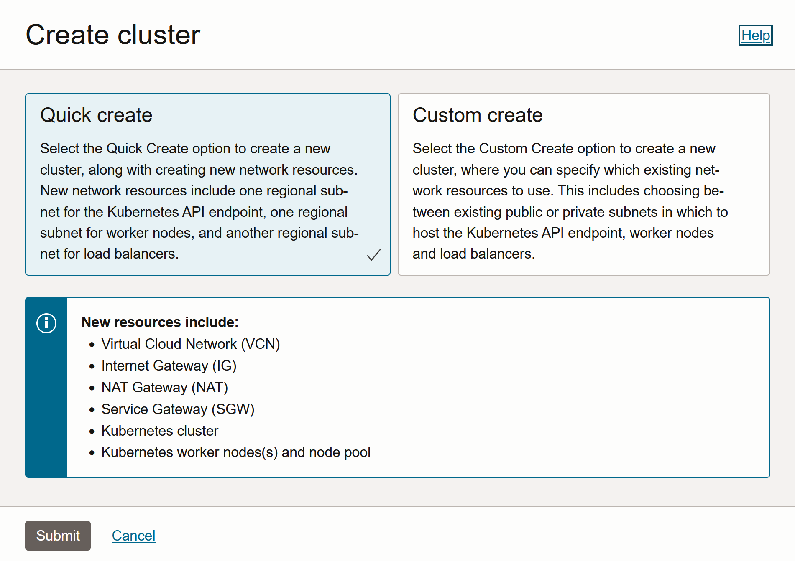

# OCI Image GenAI with NVIDIA GPU Operator for Oracle Kubernetes Engine

[](https://img.shields.io/badge/license-UPL-green) [](https://sonarcloud.io/dashboard?id=oracle-devrel_oci-rag-vectordb)

## Introduction

A classic example of HPC (namely High-Performance Computing) with Kubernetes is the following: let's say we need to run two workloads that require GPU, and we had in our OCI account access to a single machine/node with a single GPU. There are a several of problems we encounter right off the bat:

- These workloads can't both be scheduled in the same machine at the same time, so we need a *scheduler* that helps us with free time slices in our machines (thanks to Kubernetes)
- We need to install the NVIDIA drivers into the machine that will execute the task (thanks to NVIDIA GPU Operator)
- Also, installing these drivers isn't a trivial task: they need to be installed in the containers themselves
- Kubernetes lacks some customization options, like allowing the scheduler to time slice the time in different frequency intervals (short, medium, long) to distribute tasks, if we **did** have more than one GPU in the same node.
- Kubernetes also lacks the ability to have more than one GPU type per node
- There's no support either for providing complex constraints when requesting a GPU by the scheduler.

And these are only the start of the problems we'd have: which nodes do we install dependencies on? How do we know if there's a GPU available at the required time? This is where Kubernetes + NVIDIA GPU Operator come in and help us with all these issues simultaneously.

Kubernetes provides access to special hardware resources such as NVIDIA GPUs, NICs, Infiniband adapters and other devices through the [device plugin framework](https://kubernetes.io/docs/concepts/extend-kubernetes/compute-storage-net/device-plugins/).

However, configuring and managing nodes with these hardware resources requires configuration of multiple software components such as drivers, container runtimes or other libraries which are difficult and prone to errors.

The **NVIDIA GPU Operator** uses the operator framework within Kubernetes to automate the management of all NVIDIA software components needed to provision GPU. These components include the NVIDIA drivers (to enable CUDA), Kubernetes device plugin for GPUs, the NVIDIA Container Runtime, automatic node labelling, DCGM based monitoring and others.

Therefore, we will show how you can use the NVIDIA GPU Operator on Oracle Kubernetes Engine, to install the dependencies you need to run an image Generative AI model, and produce images 

> **Note**: the purpose of the GPU Operator is specifically useful for scenarios where the Kubernetes cluster needs to scale quickly - for example provisioning additional GPU nodes on the cloud or on-prem and managing the lifecycle of the underlying software components. In our case, this is a perfect use case for the operator, since the GenAI pipeline can certainly benefit from having scalable resources, e.g. when producing a lot of images (even from several users at the same time).

To finalize, we will use our Kubernetes GPU cluster to start generating images (and offloading these computations to the Cloud). The only thing we'll do locally is take screenshots (of whatever we want the generations to be about) and sending them through an HTTP endpoint to the cluster, which will ultimately process these images and return the generation results.

For the infrastructure, we will have the following OCI Services present:

- **Oracle Kubernetes Engine** cluster for providing a scalable GPU cluster to generate images
- **NVIDIA GPU Operator** for automatically installing dependencies, drivers to support the seamless functioning of our GPU cluster.
- **OCI Cloud Shell** for connecting to the OKE GPU cluster, installing the NVIDIA GPU Operator, and interacting with the cluster securely.

For data, we'll be using an **Image GenAI** scenario. Image GenAI is a part of Generative AI that focuses on producing 2-dimensional data, rather than text (1-dimensional). Images are, in fact, matrices of pixels that hold the RGB (and transparency) components for each pixel. So, just think that since we're not operating with vectors (vector = 1-dimensional matrix, all data fits in one row) as with Large Language Models, we need to work with **matrices** (2-dimensional matrix, it has n rows x m columns where n,m are integers.)

The bigger the matrix is, the more pixels of the image it can hold, so an image in HD resolution (1920x1080 pixels) can be represented in a matrix of 1920 rows and 1080 columns.

### Use Cases

This solution is particularly useful for those of you who are trying to easily scale, manage and deploy a GPU cluster (or a CPU cluster by default as well) in OCI, and also learning a bit about Image Generative AI.

## 0. Prerequisites and setup

- Oracle Cloud Infrastructure (OCI) Account with available credits to spend
- [Appropriate policies for the GenAI Agents Service](https://docs.oracle.com/en-us/iaas/Content/generative-ai-agents/iam-policies.htm#policies) set up properly within your tenancy
- [Oracle Cloud Infrastructure Documentation - Generative AI Agents](https://docs.oracle.com/en-us/iaas/Content/generative-ai-agents/overview.htm#overview)
- [Oracle Cloud Infrastructure (OCI) Generative AI - Getting Started](https://docs.oracle.com/en-us/iaas/Content/generative-ai-agents/getting-started.htm#get-started)
- [Oracle Cloud Infrastructure (OCI) Generative AI - API](https://docs.oracle.com/en-us/iaas/api/#/en/generative-ai-agents/20240331/)
- [Python 3.10](https://www.python.org/downloads/release/python-3100/)
- [Conda](https://conda.io/projects/conda/en/latest/user-guide/install/index.html)

## 1. Create OCI Kubernetes Engine Cluster

1. Navigate to your OCI console, and in the navigation bar, search for "Kubernetes Clusters" or "OKE":

    

2. Let's create a new OKE cluster for this solution:

    

3. Select the "Quick Create" option which will simplify all required resources, like networking and the worker nodes:

    

4. Select "Public endpoint" (to allow public IP address access), node type: managed (worker nodes are provisioned in the tenancy), and select your preferred type of worker nodes (either public or private):

    

5. For the shape, select whichever GPU shape you have available in your tenancy. For the OS image, select Oracle Linux 8. If you ran out of limits, check out [this guide](https://docs.oracle.com/en/cloud/get-started/subscriptions-cloud/mmocs/requesting-service-limit-change.html) on how to request a service limit increase.

    

6. Now that we've finished with creation, we can access our OKE cluster once it's been created, and click on "Access Cluster":

    

7. Finally, we can copy the command to access from Cloud Shell (recommended):

    

8. And we run this command in our Cloud Shell instance:

```bash
oci ce cluster create-kubeconfig --cluster-id <YOUR_CLUSTER_OCID> --file $HOME/.kube/config --region <YOUR_REGION> --token-version 2.0.0  --kube-endpoint PUBLIC_ENDPOINT
```

## 2. Installing the NVIDIA GPU Operator

Once we have our OCI Kubernetes Engine Cluster created and we've been able to connect to our cluster through Cloud Shell, we need to install the NVIDIA Operator on it.

1. We need to check that we already have `kubectl` and `helm` installed. If you're missing helm, run the following command:

    ```bash
    curl -fsSL -o get_helm.sh https://raw.githubusercontent.com/helm/helm/master/scripts/get-helm-3 \
    && chmod 700 get_helm.sh \
    && ./get_helm.sh
    ```

2. All worker nodes or node groups to run GPU workloads in the Kubernetes cluster must run the same operating system version to use the NVIDIA GPU Driver container.

3. Add the NVIDIA Helm repository:

    ```bash
    helm repo add nvidia https://helm.ngc.nvidia.com/nvidia \
    && helm repo update
    ```

4. Install the GPU Operator (with default configuration):

    ```bash
    helm install --wait --generate-name \
    -n gpu-operator --create-namespace \
    nvidia/gpu-operator
    ```

> **Note**: to Install the GPU Operator with custom configurations, refer [to this document](https://docs.nvidia.com/datacenter/cloud-native/gpu-operator/latest/getting-started.html#gpu-operator-helm-chart-options).

## 3. (Optional) Deploy additional services into the cluster: Jupyter Notebook

1. You can easily deploy services like a Jupyter Notebook in your cluster, by specifying a YAML file with some restrictions. For reference, take a look at [this YAML file](./tf-notebook.yaml) which illustrates the creation of a service (exposing port 80 for our convenience) and a pod to host the Jupyter notebook with a TensorFlow GPU image:

    

2. We apply the manifest to `kubectl` in order to deploy the pod and the service:

    ```bash
    kubectl apply -f tf-notebook.yaml
    ```

3. We check the pod status:

    ```bash
    kubectl get pod tf-notebook
    ```

    Once its status = "RUNNING", we can access the notebook.

4. Since the manifest includes a service, we can obtain the external IP address + port to access it:

    ```bash
    kubectl get svc tf-notebook
    ```

5. We open up a browser and access the service. Finally, we just need the authentication token to get permission to the Jupyter notebook server:

    ```bash
    kubectl logs tf-notebook
    ```

The notebook should now be accessible from your browser at this URL: http://<MACHINE_IP_ADDRESS>:30001/?token=<TOKEN_FROM_LOGS>.

http://207.211.187.206:30001/

Theoretically, we could run our code in the Jupyter Notebook, 

## 4. Deploy Image GenAI in OKE


## Demo

[Watch the demo here](https://www.youtube.com/watch?v=JqF6Bc9am4s&list=PLPIzp-E1msraY9To-BB-vVzPsK08s4tQD&index=15)

## Tutorial

TODO

[This is a tutorial](https://docs.oracle.com/en/learn/oci-opensearch/index.html#introduction) about OCI OpenSearch if you're interested in learning more about vectorization, indexation, connecting to the cluster, ingesting data, searching for data and visualizing it.

## Physical Architecture


## Contributing

This project is open source. Please submit your contributions by forking this repository and submitting a pull request! Oracle appreciates any contributions that are made by the open source community.

## License

Copyright (c) 2022 Oracle and/or its affiliates.

Licensed under the Universal Permissive License (UPL), Version 1.0.

See [LICENSE](LICENSE) for more details.

ORACLE AND ITS AFFILIATES DO NOT PROVIDE ANY WARRANTY WHATSOEVER, EXPRESS OR IMPLIED, FOR ANY SOFTWARE, MATERIAL OR CONTENT OF ANY KIND CONTAINED OR PRODUCED WITHIN THIS REPOSITORY, AND IN PARTICULAR SPECIFICALLY DISCLAIM ANY AND ALL IMPLIED WARRANTIES OF TITLE, NON-INFRINGEMENT, MERCHANTABILITY, AND FITNESS FOR A PARTICULAR PURPOSE.  FURTHERMORE, ORACLE AND ITS AFFILIATES DO NOT REPRESENT THAT ANY CUSTOMARY SECURITY REVIEW HAS BEEN PERFORMED WITH RESPECT TO ANY SOFTWARE, MATERIAL OR CONTENT CONTAINED OR PRODUCED WITHIN THIS REPOSITORY. IN ADDITION, AND WITHOUT LIMITING THE FOREGOING, THIRD PARTIES MAY HAVE POSTED SOFTWARE, MATERIAL OR CONTENT TO THIS REPOSITORY WITHOUT ANY REVIEW. USE AT YOUR OWN RISK.
